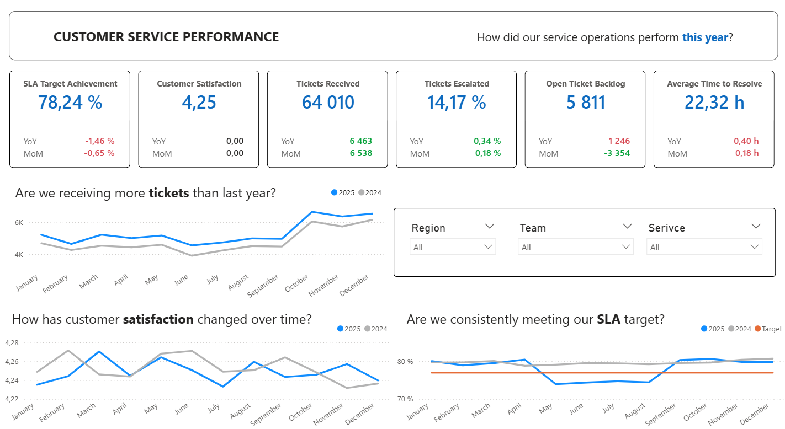
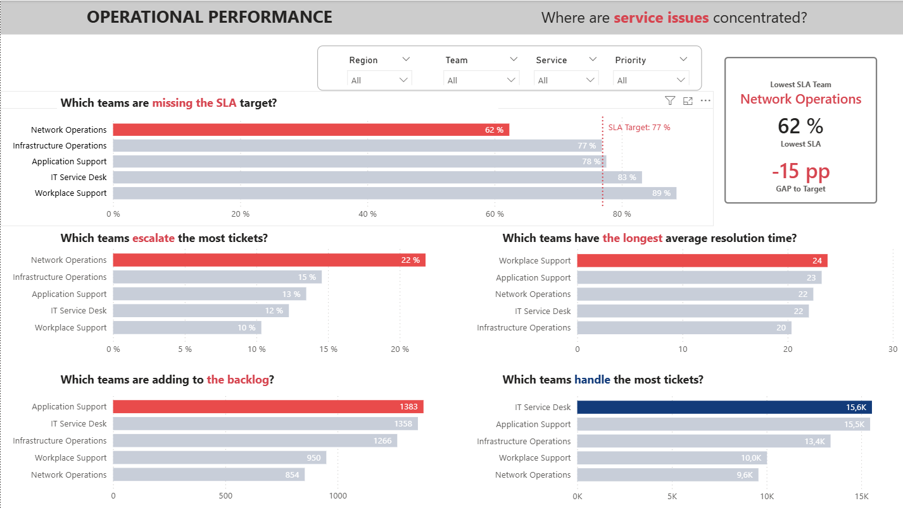

# Operations Performance & KPI Dashboard

## Executive Summary

This end-to-end Business Intelligence project analyzes the performance of a simulated internal IT service operation.

The dashboard helps IT Operations managers monitor service demand, SLA compliance, customer satisfaction, escalation rates, resolution time, and open-ticket backlog.

The analysis highlights underperforming teams, identifies factors associated with lower CSAT, and supports operational prioritization.

---

## Dashboard Preview

### Executive Overview



### Operational Performance



---

## Business Questions

The dashboard answers the following questions:

- Are SLA targets being achieved?
- How is ticket demand changing over time?
- Which teams are missing SLA targets?
- Which teams generate the most escalations?
- Which teams own the largest backlog?
- How do SLA breaches, escalations, reopened tickets, and complexity relate to CSAT?
- Which operational areas require management attention?

---

## Key Insights

- 2025 ticket volume reached **64,010**, an increase of approximately **11.2% YoY**.
- SLA compliance was **78.24%**, above the **77% target**, but declined by **1.46 percentage points YoY**.
- Ticket growth was strongest in **Q4**.
- **Network Operations** recorded the lowest SLA compliance and the highest escalation rate.
- Escalated tickets had an average CSAT of **3.89**, compared with **4.31** for non-escalated tickets.
- Reopened tickets had an average CSAT of **3.94**, compared with **4.27** for tickets that were not reopened.
- Complex tickets received lower average CSAT than simple tickets.
- Tickets resolved after more than 72 hours had lower customer satisfaction.
- The backlog improved month over month but remained above the prior-year level.

---

## Recommended Actions

- Prioritize a root-cause review of Network Operations.
- Review escalation criteria and first-line resolution capabilities.
- Investigate the causes of reopened tickets.
- Prepare additional capacity for Q4 demand.
- Analyze backlog by team, service, priority, and ticket complexity.

---

## Technology Stack

- MySQL
- SQL
- Power BI
- DAX
- Python
- Star schema data model
- Git and GitHub

---

## Data Model

The project uses a star schema with the following tables.

### Fact Tables

- `fact_tickets`
- `fact_csat`
- `fact_capacity`
- `fact_costs`
- `fact_cost_details`

### Dimension Tables

- `dim_date`
- `dim_team`
- `dim_region`
- `dim_service`
- `dim_priority`

The dataset contains **121,557 tickets** covering the period from January 2024 through December 2025.

---

## Data Validation

SQL checks were created to validate:

- duplicate ticket IDs;
- missing key values;
- date coverage;
- ticket-status distribution;
- SLA-compliance distribution;
- CSAT response rate;
- business relationships between SLA, escalation, complexity, reopened tickets, resolution time, and CSAT.

Selected findings:

| Comparison | Average CSAT |
|---|---:|
| SLA met | 4.28 |
| SLA breached | 4.14 |
| Non-escalated | 4.31 |
| Escalated | 3.89 |
| Not reopened | 4.27 |
| Reopened | 3.94 |
| Simple tickets | 4.29 |
| Complex tickets | 4.08 |

These relationships are descriptive and should not be interpreted as causal.

---

## Repository Structure

```text
│
├── data/
│   ├── dim_date.csv
│   ├── fact_tickets.csv
│   ├── fact_csat.csv
│   └── ...
│
├── python/
│   └── generate_operations_kpi_dataset.py
│
├── sql/
│   ├── 01_create_schema.sql
│   ├── 02_load_data.sql
│   ├── 03_data_quality_checks.sql
│   ├── 04_business_logic_validation.sql
│   └── 05_kpi_analysis.sql
│
├── powerbi/
│   └── Operations_Performance.pbix
│
├── images/
│   ├── executive_overview.png
│   └── operational_performance.png
│
└── README.md
```
---

## Data Note

This project uses a synthetic dataset created for portfolio purposes.
The data does not represent a real company, customer, employee, or operational system.

---

## Limitations
The dataset is synthetic.
The analysis is descriptive rather than causal.
CSAT results are based only on survey respondents.
Team performance may be influenced by ticket complexity, priority, and service mix.